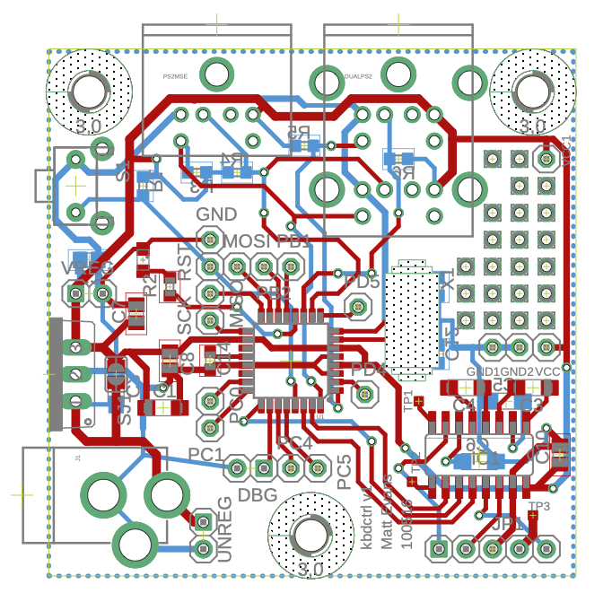

# SGI Indigo PS/2 keyboard/mouse adapter PCB

26 April 2026

This is the PCB companion to the [sgi_indigo_kbdctrl firmware](https://github.com/evansm7/sgi_indigo_kbdctrl) project. 

Has enough on board to be self-powered using the 8V from the Indigo, or can be built with a barrel jack to take 5VDC (which is probably nicer for the SGI).

Can be built with a dual/stacked PS/2 connector for keyboard/mouse in one footprint, or two one-socket connectors side by side.

# License

sgi_kbdctrl_hw is copyright 2016 Matt Evans.

This work is licensed under the Creative Commons Attribution-NonCommercial-ShareAlike 3.0 Unported License. To view a copy of this license, visit http://creativecommons.org/licenses/by-nc-sa/3.0/ or send a letter to Creative Commons, PO Box 1866, Mountain View, CA 94042, USA.